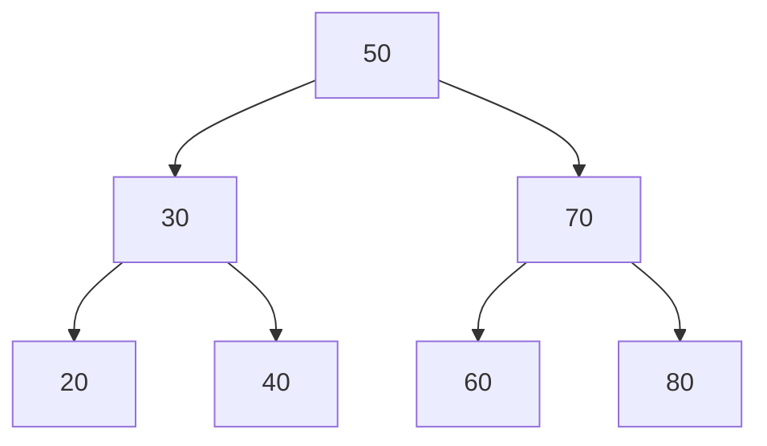

# 🌳 Binary Search Tree (BST)

Implementation of a Binary Search Tree in both **Go** and **Python** — supporting insert, search, delete, and multiple traversal methods.

---

## 📁 Project Structure

```
bst/
├── bst.go        # Go implementation
├── bst.py        # Python implementation
└── README.md
```

---

## ⚙️ Features

| Feature | Description |
|---|---|
| `Insert` | Add a value to the tree |
| `Search` | Check if a value exists — O(log n) |
| `Delete` | Remove a value (handles all 3 cases) |
| `InOrder` | Left → Root → Right (sorted output) |
| `PreOrder` | Root → Left → Right |
| `Height` | Returns the depth of the tree |

---

## 🐍 Run Python

```bash
python3 bst.py
```

## 🐹 Run Go

```bash
go run bst.go
```

---

## 📊 Sample Output

```
Inserting values: [50, 30, 70, 20, 40, 60, 80]

── Traversals ──
In-Order  (sorted): [20, 30, 40, 50, 60, 70, 80]
Pre-Order         : [50, 30, 20, 40, 70, 60, 80]
Tree Height       : 3

── Search ──
Search(40) → True
Search(99) → False

── Delete 30 ──
In-Order after delete: [20, 40, 50, 60, 70, 80]
```

---

## 🧠 How BST Works

```
Insert: 50, 30, 70, 20, 40, 60, 80

        50
       /  \
      30   70
     / \  / \
    20 40 60 80
```

- **Left** child is always **smaller** than parent
- **Right** child is always **larger** than parent
- Delete with two children → replaced by **in-order successor**

---

## 🖼️ Visual Diagram



---

## 🛠️ Tech Stack

- Python 3.x
- Go 1.21+

---

## 👤 Author abdelhai eltigani